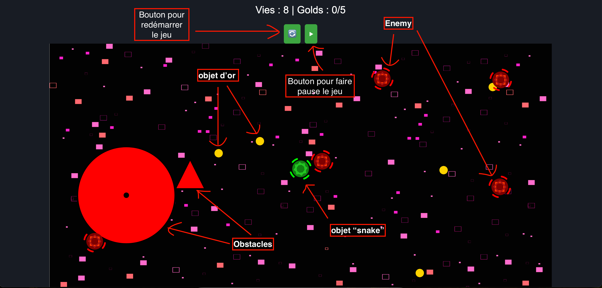
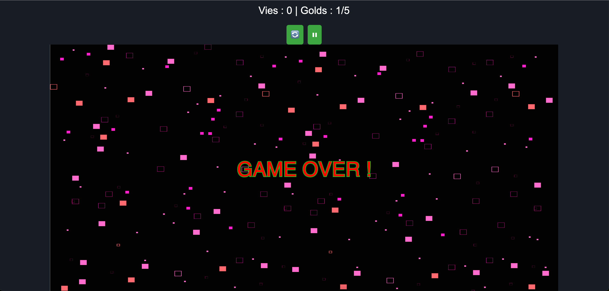

# Survival Chase

## Description
Survival Chase est un jeu développé en utilisant p5 du JavaScript. Le but de ce jeu est de contrôler l'objet "snake" dans le canva pour collecter le nombre d'objet d'or fixé à chaque niveau et protéger le nombre de vie qu'il possède du jeu en évitant les obstacles et les ennemies. 


---

## Fonctionnalités
- **Mouvement du Joueur** :
  - Le joueur peut être contrôlé à l'aide des touches fléchées du clavier.
  - Un mouvement continu est possible si une touche est maintenue enfoncée.
- **Gestion des Ennemis** :
  - Les ennemis poursuivent le joueur en utilisant une logique vectorielle.
  - Lorsqu'un ennemi touche le joueur, il disparaît et réapparaît à une position aléatoire loin du joueur.
- **Gestion des Vies** :
  - Le joueur commence avec 8 vies.
  - Les vies sont affichées en dehors du canvas.
  - Une collision avec un ennemi réduit les vies du joueur de 1.
  - Si les vies atteignent 0, le jeu se termine avec un message "GAME OVER".

  
- **Pause et Contrôle de la Vitesse** :
  - Des boutons pour démarrer, mettre en pause.

---

## Exigences
Pour exécuter ce projet, vous aurez besoin de :
- Un navigateur moderne prenant en charge JavaScript.
- L'extension "Live Server" installée. 
- La bibliothèque **p5.js** pour les animations et la logique vectorielle.

---

## Installation et Execution
1. Clonez le projet
   ```bash
   git clone https://github.com/Hamdaoui1/Survival-Chase.git
   ```
2. Naviguez vers le répertoire du projet:
   ```bash
   cd Survival-Chase
   ```
3. Cliquez droit sur sur fichier `index.html` et choissiez "Open with Live      Server" pour lancer le jeu.

---

## Les comportements développées dans ce jeu (appliation du cours IAs Réactives)
1. Le suivi du leader 
2. L'évitement de la collision  entres les enmeies 
3. L'évitement des obstacles
---

## Réalisateurs du projet
Ce projet a été réalisé par **Hamdaoui1** (Hamza Hamdaoui) & **Linhkobe** (Tuan Linh Dao).
